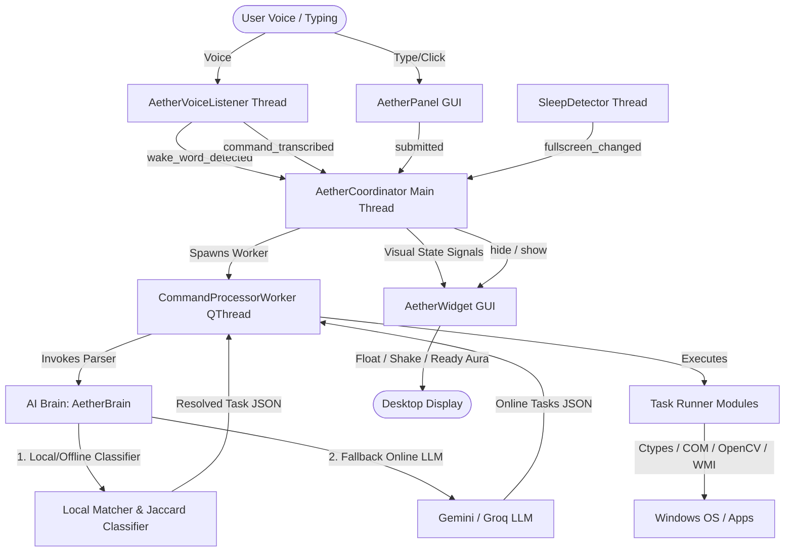
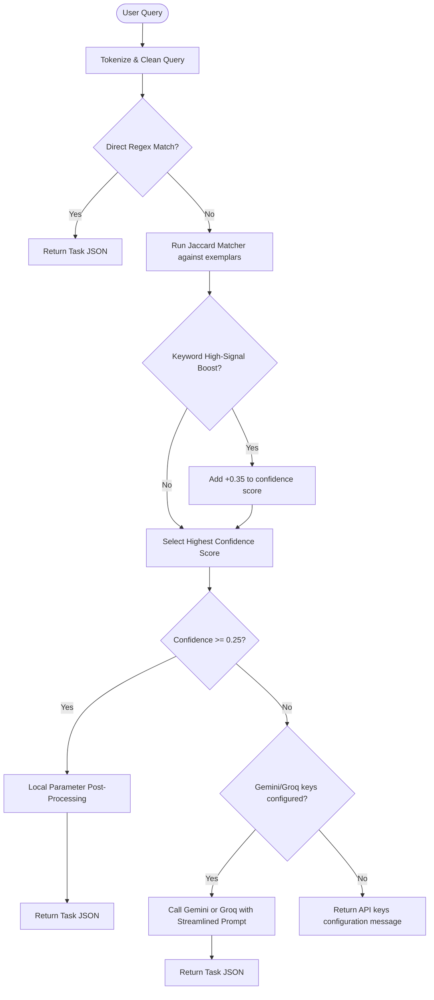
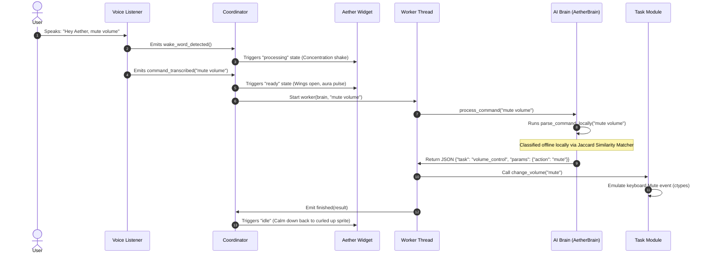

# ✨ Aether Desktop Companion - Architecture & Technical Guide

Welcome to the **Aether Desktop Companion** technical documentation. This guide details the system architecture, component logical paths, PyQt5 threading model, native Windows API integrations (`ctypes`/PowerShell), and data flows.

---

## 📐 System Architecture Flow

Aether uses a hybrid parsing and multi-threaded execution model to ensure that heavy tasks (speech recognition, local processing, LLM queries, sleep monitoring) do not freeze the main Qt GUI event loop.



---

## 📂 Project Directory Structure

Here is a map of the repository files and their logical boundaries:

```text
aether-assistant/
│
├── main.py                  # Orchestrator: Coordinator, QThread Workers, UI bridges
├── requirements.txt         # Project package requirements (pyperclip, pypdf, etc.)
├── .env                     # Private environment keys (API Keys)
├── .gitignore               # Excludes DB and temp logs from version control
├── understanding_changes.md # Explanation of the local classifier design
│
├── ui/
│   ├── widget.py            # Floating widget, BFS transparency, screen-shake physics, glowing animations
│   ├── panel.py             # Aether HUD command panel, custom scrollbars, styling
│   └── assets/              # Sprite images (aether_idle.png, aether_charging.png, aether_ready.png)
│
├── voice/
│   └── listener.py          # Speech recognition loop using recognize_google
│
├── brain/
│   └── agent.py             # AI Brain: Local Jaccard intent classifier + fallback LLM routing
│
├── memory/
│   └── history.py           # Local SQLite task history storage
│
├── tasks/
│   ├── open_app.py          # Fuzzy matching launcher for shortcuts and executables
│   ├── file_finder.py       # Exclude-heavy local file navigator
│   ├── draft_text.py        # Copy text block summaries to clipboard
│   ├── reminder.py          # Native Windows toast timers
│   ├── summarize_file.py    # Document text parser (.txt, .docx, .pdf)
│   ├── volume_control.py    # Master volume keyboard simulation via ctypes
│   ├── brightness_control.py# Screen brightness WMI controls via PowerShell
│   ├── clipboard_manager.py # Background clipboard logger database interface
│   ├── close_window.py      # Active foreground window closer via PostMessage
│   ├── minimize_all.py      # Show desktop command using COM interface
│   ├── lock_screen.py       # Lock Windows workstation via User32.dll ctypes
│   ├── take_screenshot.py   # Screen capture via QScreen
│   ├── delete_file.py       # Local file deletion with GUI confirmation
│   └── screen_record.py     # Desktop video recorder thread using OpenCV
│
└── utils/
    ├── sleep_detector.py    # Fullscreen window focus tracking via Win32 ctypes
    └── config.py            # Global paths and parameters loader
```

---

## 🧠 Hybrid Intent Classification Engine

Aether uses a **hybrid parsing architecture** that resolves commands locally using pure Python whenever possible, falling back to LLMs only for open-ended queries or tasks requiring generation.



### 1. Preprocessing & Cleaners
- **`_tokenize_text(text)`**: Strips punctuation, downcases, and removes structural stopwords (e.g. `"please"`, `"could"`, `"for"`, `"me"`) to extract core search terms.
- **`_clean_extracted_param(val)`**: Post-processes parameter outputs to strip trailing prepositions (e.g., `"from folders"`, `"in directory"`) and generic descriptive words (e.g. `"app"`, `"file"`, `"scroll"`).

### 2. Local Similarity Matcher
We maintain a library of common training exemplar phrases (`OFFLINE_EXEMPLARS`) and semantic anchor words (`HIGH_SIGNAL_KEYWORDS`) for the 12 offline-compatible tasks.
- If a query overlaps with an exemplar, a **Jaccard Similarity Coefficient** (`|Intersection| / |Union|`) is computed.
- If the query contains a semantic anchor (like `"brightness"` for `brightness_control`), it receives a **+0.35 confidence boost**.
- If the confidence score meets or exceeds `0.25`, the command is executed locally.

### 3. Streamlined LLM System Prompt
Because the 12 offline-compatible tasks are classified locally, they have been completely removed from the online LLM's system instructions. This prompt now only documents:
- **`draft_text`**: Generate paragraphs/emails.
- **`summarize_file`**: Read file content and generate summaries.
- **`unknown`**: General QA/conversational responses.

*Benefit: Reduces system prompt size by ~80%, yielding major savings in token consumption, faster API response times, and lower latency.*

---

## 🧵 The Threading Model & Coordination

In PyQt5, modifying UI components (loading sprites, moving coordinates) from background threads results in memory access crashes or silent freezes (`0xC0000409`).

### `AetherCoordinator` (Main UI Thread)
Located in `main.py`, `AetherCoordinator` instantiates the UI (`AetherWidget`, `AetherPanel`) and connects them using **Qt Signals**. It manages all visual states, processes incoming voice signals, and manages workers.

### `CommandProcessorWorker` (QThread Worker)
When a command is received, instead of running parsing directly on the UI thread, `AetherCoordinator` starts `CommandProcessorWorker`. This worker:
1. Calls the `AetherBrain` parser locally or invokes LLMs in the background.
2. Directs the request to the matching task module.
3. Emits `finished` with a result dictionary, allowing the UI thread to display responses safely.

---

## 🔍 Detailed Component Deep Dive

### 1. Sprite Overlay & Physics — [ui/widget.py](file:///c:/Projects/DeskBud/ui/widget.py)
* **Floating Bobbing**: Uses a QTimer executing a sine wave physics offset `y = base_y + int(10 * math.sin(self.bob_angle))` to make Aether hover gently on the screen.
* **Magical Concentrating/Shaking**: Offsets the widget's coordinates randomly inside a small bounds list during processing, simulating a concentration shake.
* **Awakened/Ready Aura**: Pulses the widget opacity between `0.9` and `1.0` using a glowing aura timer.
* **BFS Flood-Fill Transparency (`make_image_transparent`)**:
  Starting from the image borders, a Breadth-First Search (BFS) traverses pixels matching the background dark color (color distance threshold `< 40`). All visited outer pixels are set to `0` alpha (fully transparent), while interior dark pixels (Aether's dark details/scales) are skipped.

### 2. HUD Companion Panel — [ui/panel.py](file:///c:/Projects/DeskBud/ui/panel.py)
* **Glassmorphism CSS Styling**: Dark slate/charcoal backgrounds, warm gold/amber borders, and text fields that highlight when in focus.
* **Direct Scrollbar Override**: Bypasses Windows scrollbars by styling the list's `verticalScrollBar()` directly and setting horizontal scrolling to `ScrollBarAlwaysOff`.

### 3. Voice Recognizer Thread — [voice/listener.py](file:///c:/Projects/DeskBud/voice/listener.py)
* **Calibration**: Capped at `600` maximum energy threshold to prevent desensitization in noisy rooms.
* **Seamless Gaps**: `pause_threshold = 1.3` allows you to say *"Hey Aether... close this window"* in a single natural sentence without getting split-transcribed.
* **Inline Extraction**: If the voice block contains a wake word (e.g., *"hey aether"*), the listener splits the text string and immediately fires the trailing phrase as the active command.

### 4. Sleep Detector — [utils/sleep_detector.py](file:///c:/Projects/DeskBud/utils/sleep_detector.py)
* Runs a loop calling Win32 `GetForegroundWindow` and `GetWindowRect`.
* If the active window's dimensions match the monitor's dimensions, it flags it as a fullscreen application (game/video) and hides Aether to save resources and clear your screen.

---

## ⚡ Task Runners Logic

* **Volume Control (`tasks/volume_control.py`)**:
  Calls `ctypes.windll.user32.keybd_event` using Windows VK codes (`0xAD` mute, `0xAE` volume down, `0xAF` volume up) to control volume directly through the hardware emulation layer.
* **Brightness Control (`tasks/brightness_control.py`)**:
  Executes WMI PowerShell scripts to change screen brightness level via standard Monitor Brightness methods.
* **Clipboard History Tracker (`tasks/clipboard_manager.py`)**:
  Tracks clipboard text changes every 2 seconds. If a new text block is copied, it writes it locally to the SQLite `clipboard_history` table.
* **Active Window Closer (`tasks/close_window.py`)**:
  Grabs the focused `hwnd` using ctypes and posts a native Windows `WM_CLOSE (0x0010)` message directly to the window loop.
* **Minimize All (`tasks/minimize_all.py`)**:
  Invokes PowerShell COM wrapper shell code `(New-Object -ComObject Shell.Application).MinimizeAll()` to minimize active monitors.
* **Delete File (`tasks/delete_file.py`)**:
  Performs fuzzy matching on local folders, prompts the user with a stylized PyQt5 confirmation dialog box, and deletes the file safely using `os.remove`.
* **Screen Recording (`tasks/screen_record.py`)**:
  Starts a background `VideoWriter` thread that records monitor frames at 10fps and writes them to a local video container.

---

## 🔄 Command Execution Sequence



---

## 🚀 Quick Run
1. Install packages: `pip install -r requirements.txt`
2. Start the application: `python main.py`
3. Launch silently in the background: `pythonw main.py`
