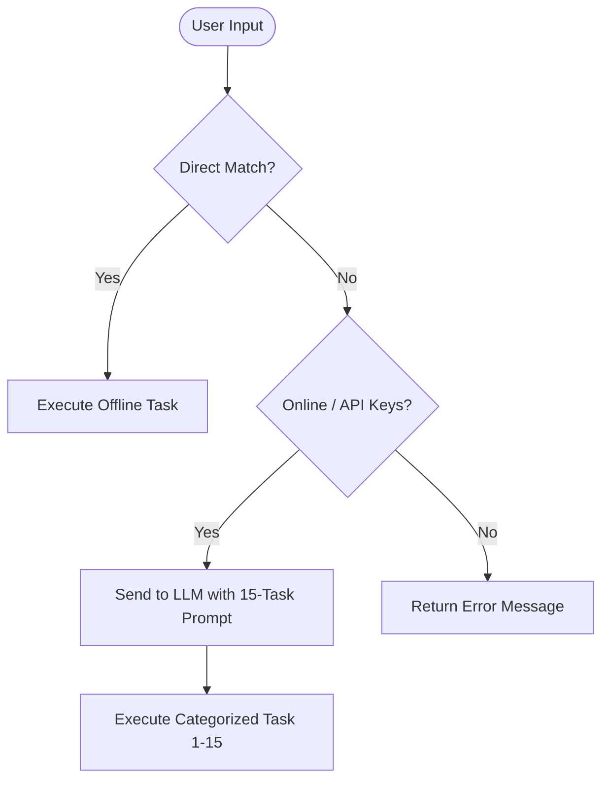
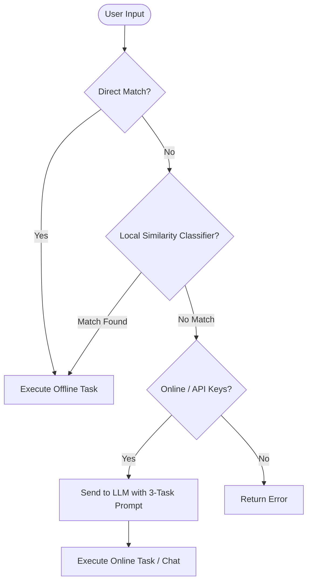

# Understanding Changes: Offline Intent Classification & LLM Prompt Optimization

This document outlines the architectural changes made to enable **local offline intent classification** for DeskBud, explaining the rationale, design, and internal details of the new implementation.

---

## 1. Rationale & Goal

Previously, DeskBud had two modes:
1. **Offline Mode**: A basic keyword matcher checked for simple direct commands (e.g. `"volume up"`). If it failed, the app could not execute the command because LLM access was unavailable.
2. **Online Mode**: If a command didn't match the basic local keywords, it was sent to the online Gemini/Groq APIs. The LLM parsed the user's intent using a large, expensive system prompt containing all 15 tasks.

**The Drawbacks:**
- **High Token Consumption**: The LLM prompt was unnecessarily large because it had to specify instructions and JSON schemas for 12 tasks that could actually run locally.
- **Degraded Offline Capabilities**: Slight variations in command phrasing (e.g. `"could you turn the volume up please"`) failed to run offline because they didn't match the strict local regexes.

**The Solution:**
We removed the 12 offline-compatible tasks from the online LLM's system prompt and built a **lightweight local classifier** using pure Python matching logic. This local classifier runs instantly, works online and offline, handles natural language variations, and keeps the online LLM focused only on complex online tasks (`draft_text`, `summarize_file`, `unknown`).

---

## 2. Architecture Comparison

### Before Changes

### After Changes

---

## 3. Key Components Implemented

All changes are concentrated in [agent.py](file:///c:/Projects/DeskBud/brain/agent.py).

### A. Preprocessing Helpers
To compare phrases accurately without being confused by sentence fillers:
- **`_tokenize_text(text)`**: Converts queries to lowercase, strips punctuation, and filters out common grammatical stopwords (e.g., *"a"*, *"the"*, *"please"*, *"for"*).
- **`_clean_extracted_param(val)`**: Strips noise words and descriptors (e.g. *"app"*, *"file"*, *"from folders"*) from target parameters like filenames and application names.

### B. Exemplars & Signal Keywords
We defined reference lists of training sentences (`OFFLINE_EXEMPLARS`) and high-signal intent terms (`HIGH_SIGNAL_KEYWORDS`) for all 12 offline tasks. Examples:
- `volume_control`: *"louder"*, *"quieter"*, *"mute"*, *"silence"*
- `open_app`: *"launch explorer"*, *"open chrome"*, *"run calc"*

### C. Similarity Engine (`AetherBrain.classify_offline_intent`)
Calculates a matching confidence score for each task:
1. Computes **Jaccard Similarity** (word overlap) between the user's input tokens and the exemplar phrases.
2. Applies a **+0.35 confidence boost** if the query contains a high-signal keyword unique to that task.
3. If the highest score exceeds the threshold of `0.25`, the intent is classified.

### D. Parameter Extraction Fallback
Once classified, we run robust parsing logic inside [`AetherBrain.parse_command_locally`](file:///c:/Projects/DeskBud/brain/agent.py) to extract task-specific arguments (e.g. looking for time values in reminders, extracting brightness percentage integers, or isolating folder paths).

### E. Online Prompt Streamlining
The instruction prompt returned by [`AetherBrain.get_system_prompt`](file:///c:/Projects/DeskBud/brain/agent.py) has been shortened to only document:
1. `draft_text`
2. `summarize_file`
3. `unknown` (conversational response)

---

## 4. Verification Results
We validated the classifier against 20 natural language queries representing all task types. 
- All 17 local tasks (using phrasing variations like *"silence the machine"*, *"launch the steam app please"*, *"banish invoice.txt from folders"*) matched and executed locally.
- Online tasks correctly bypassed the local classifier and fell back to the online LLM.
- **Pass Rate: 100% (20/20 cases passed)**.
